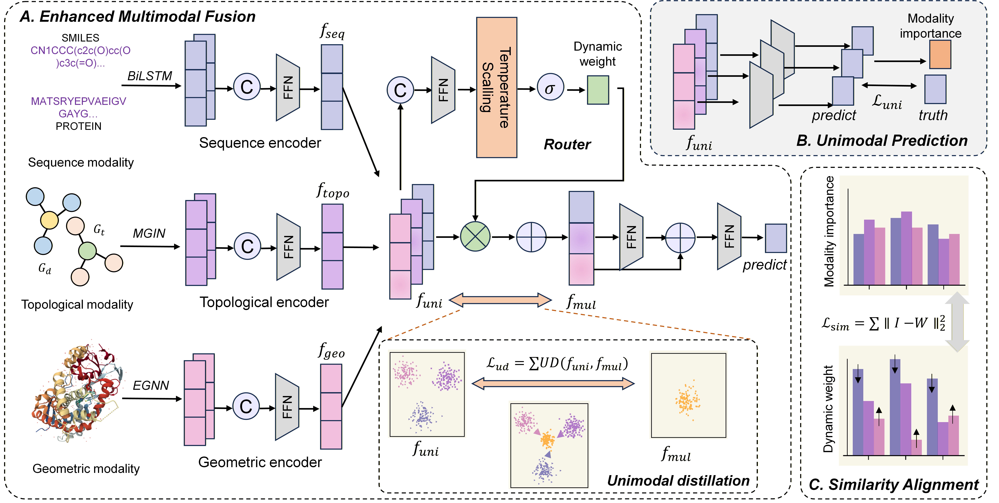

# title

Routing and Distillation Enhanced Multimodal Fusion for Robust Drug-Target Binding Affinity Prediction

## overview



## abstract

coming soon

### install

```bash
pip install -r requirements.txt
```

### dataset

coming soon

### quickly start


```bash
python main.py
```

## file

```
.
├── config.py
├── egnn.py
├── main.py
├── model.py
├── utils.py
└── __pycache__/
```

## cite
```
coming soon
```

